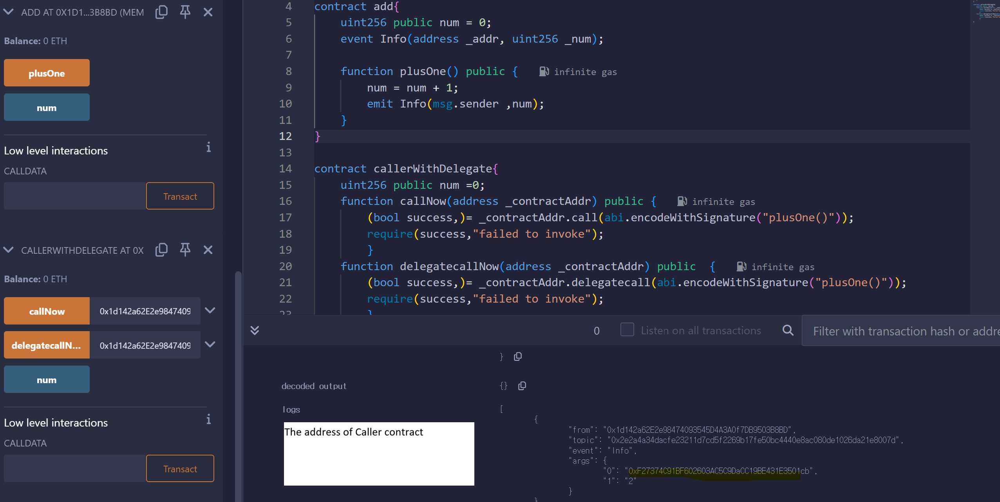

# Smart Contract: The Rule How to Operate Cryptocurrency 
e.g. Give money every a multiple of three

## Introduction
* No Print function in solidity - Use log instead
## License Identifier
Obejective
1. Boost trust in smart contract  
2. Resolve copy right issues  
MUST Comment license below *(Not necessary under 0.6.0 version)*    
* solidity license - // SPDX-License-Identifier: GPL - 30
* solidity version - e.g pragma solidity >= 0.7.0 < 0.9.0;

Must end up with semicolone

How to define contract?
- contract Helllo{}

How to make an instance of a contact => same as java,C#
A variable doesn't depend on its instance's changes  
constructor: intinitalizes variables when generalize an instance  
However, due to limited gas, we can't use the function infinitely.  
GAS (dependent on how long smart contract)  1 ether = 10^18 wei = 10^9 Gwei   
whenever to deploy smart contract, gas is used. The thing is how to deal with as less as possible

## Function
fuction NAME(PARAMETER) public { //CONTEXT}  
fuction NAME(PARAMETER) public returns (RETURNED TYPE){ //CONTEXT}  
public: anywhere  
external: contract anywhere except where defined  
private: contract only where defined  
internal: contract where defined and inherited  
view: it make variables out of a function readable but non editable  
pure: when a function doesn't use variables out of the fucntion.  
Nothing(not defined view nor pure): when a function uses variables out of the function but has to change its value  

** Better to define return parameter for better visibility
** why define 'pure' at the end? Unless using any outter variables, it must define 'pure'  

* function setAgeList(uint256 index, uint256 age) public{ageList[_index] = age;}  
* function getAge(uint256 index, uint256 age) public {return ageList[_index];}  

## Data Management
Storage: most of variables, function permanently saved here. more data need more gas  
Memory: parameters, return value, type of reference saved here temporarily. Less gas used than a storage  
Colldata: used to parameters of external function  
stack: manages stack data by EVM limited 1024MB  
* String type should be defined followed by 'memory'  

## Data Strcuture
Mapping: key-value  
mapping(uint256=>uint256) private ageList;  
* 매핑(키=>벨류) 가시성 이름;  

## Array
[Basic commands](lecture/lec18_array.sol)  
Mapping can't return length In the other hand, Array can return its lenth.  
Mapping is generally recommended. The main advantage of an array is for iteration however it may occur issues such as gas overconsumption  
 

## Inheritence
e.g. contract 상속 수신자 is 상속 송신자: The contract handed over can use the parents' functions without redefinition.  
* super
Bring up the original function by super. It's convinient since it isn't necessary to call all context from the parent's
* What is event ? instead of print due to no existance of print phrase in solidity  
emit 컨트랙트명(필요한 파라미터) -> We can record values into the block.
* Indexed - The term in event  [EXAMPLE CODE OF 'indexed'](lecture/lec14_indexed.sol)
When you get values from event index, you can't get the values which you want directly in Blockchain. Using 'indexed' makes filtered returned outcome which you want.  

Linear Search
It's impossible to compare anything directly unlike the other languuages
So, Converting to hash is mendatory using e.g. keccak256

## Overriding
'virtual' from the original function  
'override' from the overrode function  
when a cotranct wants to get inheritant by more than two.  
e.g. contract Son is Father,Mother{}  
However, they have common function, child contract must override e.g. function getMoney() public view override(부모1,부모2 또는 부모1){}  

## Error handler (0.4.22 ~ 0.7.x)  
[Basic commands & Examples](lecture/lec25_errorHandler.sol)  

assert: After gas is ran out, if it doesn't require specific condition(if it returns false), it results in an error after consuming gas. Generally used in TEST  
* assert(조건)
  
revert: It results in an error without any condition, refunding gas  
* revert(에러 메시지);
  
require: if it returns false, it results in an error with refunding gas.  
* require(조건, 에러메시지)  

## Error handler (0.8.1 ~)  
revert: if it returns false, it results in an error with refunding gas. If internal errors occur, it results in 'panic'  

## Modifier
when error phrases(revert,require,???) are many, use modifier instead.  
_; is MUST  *What is the key word _; ? to recall a function which defines the modifier*  
* modifier onlyAdult{ revert("error")}  
* function BuyCigarette(uint256 _ age) public onlyAdult return (stirng memory){return "Your payment is succedeed"}  
[example](lecture/lec30_modifier.sol)  

## Payable
It is ESSENTIAL when we send ethur by send, transfer and call  
Able to use to Functions, address, constructor  
msg.value : the value of transfer ethur  
주소.balance: The amount left balance of the address  
msg.sender: The address of The main subject using the smart contract  

The 3 methods sending Ethur [examples](lecture/lec32_payable.sol)  
send: consumed 2300 gas, return true/false depending on the result  
transfer: consumed 2300 gas, if failed, it occurs an error  
call: we can adjust gas which means variable gas set, return true/false depending on the result  
[Constraint by contructor examples](lecture/lect34_payable2.sol)  

## fallback function
[fallback&receive](lecture/lect35_fallback.sol)
## 🚨 **CAUTION**: here are a few different comments depending on version

Prior to Version 0.6  
fallback is literally role of fallback  
The features  
  1. unnamed function
  2. MUST attach 'external'
  3. payable 
why used?  
  1. To make a smart contract take Ether  
  2. After taking Ether, it makes a smart contract act somewhat  
  3. If a function that does not exist is called, it makes a smart contract act somewhat  
     
Post to Version 0.6 (0.6 Included)  
receive: only to receive Ether  
fallback: when the function executes and send Ether or there is no function existing which is called  

## Call: low level function
  1. Transfer
  2. Call external functions of smart contracts
  3. various amount of gas  
[Call function examples](lecture/lec36_call.sol)

Call vs Delegate Call
Delegate Call:
  1. msg.sender indicates the user calling the smart contract
  2. The actual values are saved into caller (it executes an external function outside where an external function is defined)
[code](lecture/lec37_delecatecall.sol)

  
  
Example situation:  
* Note that blockchain mechanism never allow to change deployed smart contracts. In condition we want to change function from already deployed smart contract, we cannot apply new function since data transfer costs a lot and we neet to update the address of all consumers who are recorded into blocks. Therefore, we use delegate call instead of call to allow change functions of smart contracts by set new address of smart contract which we want to update (called ungradable smart contract).

